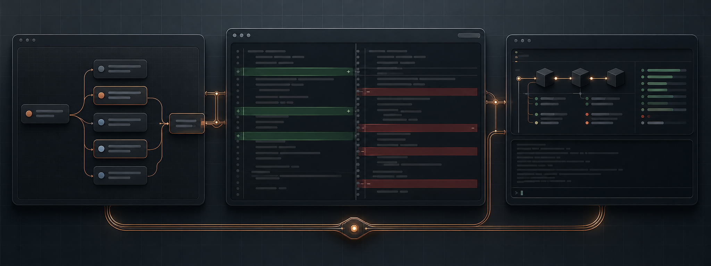
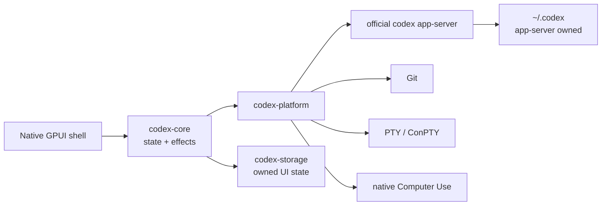

<p align="center">
  
</p>

<h1 align="center">codexRS</h1>

<p align="center">
  A native Rust replacement for Codex Desktop, targeting full behavioral and UX parity.<br>
  Official app-server compatibility without Electron, WebView, or a browser runtime.
</p>

<p align="center">
  <a href="README.md">English</a> ·
  <a href="README.ru.md">Русский</a> ·
  <a href="README.zh-CN.md">简体中文</a>
</p>

<p align="center">
  <a href="https://github.com/Kiwunaka/codexRS/actions/workflows/ci.yml"></a>
  <a href="https://github.com/Kiwunaka/codexRS/releases"></a>
  <a href="LICENSE"></a>
  <a href="https://github.com/Kiwunaka/codexRS/stargazers"></a>
  <a href="https://github.com/Kiwunaka/codexRS/graphs/contributors"></a>
  
</p>

> [!IMPORTANT]
> The current tree targets `v0.1.0-rc.3`. Windows has passed an end-to-end
> source-build smoke test against the exact stable reference. Linux is covered
> by native CI and still needs broader desktop-environment testing before a
> stable release.

## Why codexRS

Codex Desktop is useful, but a number of workflows need a smaller, inspectable
native client with predictable process and data boundaries. codexRS is that
client:

- native Rust UI built with GPUI;
- no Electron, Tauri, Wry, WebView, Node.js, or embedded browser runtime;
- the official `codex app-server` remains the source of truth;
- normal use points directly at `~/.codex`;
- live Codex auth, SQLite, JSONL, and logs are never opened by codexRS itself.

The behavioral oracle is Codex Desktop `26.721.3996.0`, which bundled Codex CLI
[`0.146.0-alpha.3.1`](https://github.com/openai/codex/releases/tag/rust-v0.146.0-alpha.3.1).
That upstream binary is a compatibility reference, not something this
repository redistributes.

## What works

| Area | Current behavior |
| --- | --- |
| Tasks | Bounded task pages, resume, fork, composer, streaming timeline, and approvals |
| Repository | Status, staged/unstaged files, large virtualized diffs, branch switching, and safe sibling worktrees |
| Terminal | Native PTY/ConPTY session with bounded VT output |
| Computer Use | Windows only: native window discovery and control with per-app approval, task access, and an app-server-owned always-allowed list |
| Plugins | Native directory tabs, bounded artwork, installed/source management, creation handoff, marketplace add/remove/upgrade, install, and uninstall through app-server methods |
| Persistence | Single-writer codexRS SQLite for UI preferences and a bounded local-project registry with names and pins |
| Platforms | Windows source build smoke-tested; Ubuntu UI, app-server, Git, and PTY build and test in CI; Linux Computer Use is unavailable in RC3 |

Computer Use is available only on Windows in RC3 and is opt-in for each task.
Every read or control action carries the
exact `Window { app, id, title? }` returned by bounded discovery; codexRS
rehydrates the opaque id and verifies its current owner before acting. The
window selected in the native inspector is only a manual convenience. The
first call for each real application asks for access to that application.
On Windows, packaged apps keep their case-preserved AUMID. Executables use the
same known-folder GUID form as stable when possible and otherwise keep their
case-preserved absolute path; legacy `process:` values remain accepted for
matching. Known shared hosts and oversized identifiers fail closed. Allow once
covers the current task, while Always allow persists through the official
app-server, but neither can override the stable product-policy block for Codex,
terminal, password-manager, identity, or security surfaces.
The native Windows app catalog can list and launch bounded entries from both
Start Menu trees, execution aliases, and installed package manifests; direct
model launches use the same per-app approval policy.
Screenshots stay in memory and are bounded before they enter the app-server
protocol. Each capture carries a short-lived screenshot ID so coordinates from
a downscaled image map back to the real window. On Windows, optional
accessibility text and indexed actions run in a supervised native Rust helper:
the tree is capped at 512 elements and 128 KiB, each request has a 10-second
deadline, and a stuck third-party UI Automation provider is terminated with
the helper instead of freezing the client. Input methods foreground their
exact target automatically, while `activate_window` remains an explicit
recovery action matching stable Window2 behavior.
Before guarded input, a native topmost system indicator with the stable
`ChatGPT is using your computer` / `Esc to cancel` copy must become visible.
It stays for the Computer Use turn, never takes focus or pointer input, and is
excluded from screenshots; failure to show it blocks the action. On Windows the
shipped `codex-computer-use-overlay.exe` companion owns that capture-excluded
window and is supervised with bounded IPC and a kill-on-close Job Object.

## Architecture



All protocol frames, queues, history pages, diffs, terminal output, screenshots,
and subprocess diagnostics have explicit limits. See
[Architecture](docs/architecture.md), [Parity matrix](docs/parity-matrix.md), and
[Platform support](docs/platform-support.md) for the full boundaries and
current gap inventory.

## Quick start

### 1. Install the official Codex CLI

Follow the current [Codex CLI setup guide](https://learn.chatgpt.com/docs/codex/cli),
then run `codex` once to sign in. codexRS supervises the CLI's native
`app-server`; it does not embed the CLI or require a Node runtime of its own.

Verify that the executable is available:

```text
codex --version
```

If it is not on `PATH`, set `CODEX_RS_CODEX_BIN` to the native `codex` or
`codex.exe` executable.

### 2. Download the portable preview

Download only from the [GitHub Releases](https://github.com/Kiwunaka/codexRS/releases)
page. The RC3 assets are
`codexrs-v0.1.0-rc.3-windows-x86_64.zip` and
`codexrs-v0.1.0-rc.3-linux-x86_64.tar.gz`, with `SHA256SUMS.txt`.
Verify the archive checksum before extraction; for example, on Linux run
`grep ' \./codexrs-v0.1.0-rc.3-linux-x86_64.tar.gz$' SHA256SUMS.txt | sha256sum -c -`,
and on Windows compare
`(Get-FileHash .\codexrs-v0.1.0-rc.3-windows-x86_64.zip -Algorithm SHA256).Hash`
with the matching entry. The checksum helps detect corruption after obtaining
it from the trusted release page; it is not an independent publisher signature.

These are unsigned portable technical-preview archives. They do not install a
Start Menu entry, URI handler, uninstaller, or updater. Extract them into a
directory you control. On Windows, keep `codexrs.exe` and
`codex-computer-use-overlay.exe` together. To update, quit codexRS and replace
the extracted directory; to remove it, delete only that directory. Neither
operation removes your `CODEX_HOME` or codexRS-owned state. Do not enable
Computer Use from an archive whose source or checksum you do not trust.

The Linux archive is not a system package: it does not install runtime
dependencies or desktop integration. Ubuntu CI builds and tests the binary, but
the extracted archive has not received a desktop smoke test. Linux Computer Use
is unavailable in RC3; X11/XWayland and pure-Wayland support remain future work.

### 3. Build codexRS

Install Git, Rust through `rustup`, and the native packages listed under
[Platform support](docs/platform-support.md), then:

```text
git clone https://github.com/Kiwunaka/codexRS.git
cd codexRS
cargo build --release -p codex-app
```

Run on Windows:

```powershell
.\target\release\codexrs.exe
```

Run on Linux:

```bash
./target/release/codexrs
```

Linux build packages and desktop-session limitations are listed in
[Platform support](docs/platform-support.md).

### Development isolation

Normal use defaults to `~/.codex`. For protocol development and tests, point
`CODEX_HOME` at an isolated directory:

```powershell
$env:CODEX_HOME = 'E:\scratch\isolated-codex-home'
cargo build -p codex-app --bins
cargo run -p codex-app --bin codexrs
```

codexRS-owned state can be redirected independently with
`CODEX_RS_DATA_DIR`.

## Contributing

Contributions are welcome. Start with
[Contributing](CONTRIBUTING.md), read [AGENTS.md](AGENTS.md), and keep changes
focused on an observable requirement or failure. Large features should begin
as an issue or discussion so the contract is clear before implementation.

- [Roadmap](ROADMAP.md)
- [Codex Desktop parity matrix](docs/parity-matrix.md)
- [Support](SUPPORT.md)
- [Security policy](SECURITY.md)
- [Code of Conduct](CODE_OF_CONDUCT.md)
- [Prior-art review](docs/prior-art.md)

## Contributors

<a href="https://github.com/Kiwunaka/codexRS/graphs/contributors">
  
</a>

## Star history

[](https://star-history.com/#Kiwunaka/codexRS&Date)

## License and upstream notice

codexRS is licensed under [Apache License 2.0](LICENSE).

This is an independent community project. It is not affiliated with or endorsed
by OpenAI. Codex and OpenAI names belong to their respective owners. The
official Codex CLI is installed and licensed separately.
