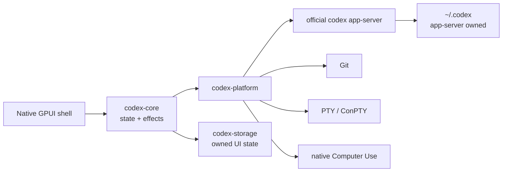

<p align="center">
  
</p>

<h1 align="center">codexRS</h1>

<p align="center">
  A native Rust workspace for the official Codex app-server.<br>
  Tasks, diffs, branches, worktrees, terminal, Computer Use, and plugins without a browser runtime.
</p>

<p align="center">
  <a href="README.md">English</a> ·
  <a href="README.ru.md">Русский</a> ·
  <a href="README.zh-CN.md">简体中文</a>
</p>

<p align="center">
  <a href="https://github.com/Kiwunaka/codexRS/actions/workflows/ci.yml"></a>
  <a href="https://github.com/Kiwunaka/codexRS/releases"></a>
  <a href="LICENSE"></a>
  <a href="https://github.com/Kiwunaka/codexRS/stargazers"></a>
  <a href="https://github.com/Kiwunaka/codexRS/graphs/contributors"></a>
  
</p>

> [!IMPORTANT]
> The current tree targets `v0.1.0-rc.1`. Windows has passed an end-to-end
> source-build smoke test against the exact stable reference. Linux is covered
> by native CI and still needs broader desktop-environment testing before a
> stable release.

## Why codexRS

Codex Desktop is useful, but a number of workflows need a smaller, inspectable
native client with predictable process and data boundaries. codexRS is that
client:

- native Rust UI built with GPUI;
- no Electron, Tauri, Wry, WebView, Node.js, or embedded browser runtime;
- the official `codex app-server` remains the source of truth;
- normal use points directly at `~/.codex`;
- live Codex auth, SQLite, JSONL, and logs are never opened by codexRS itself.

The behavioral oracle is Codex Desktop `26.721.3996.0`, which bundled Codex CLI
[`0.146.0-alpha.3.1`](https://github.com/openai/codex/releases/tag/rust-v0.146.0-alpha.3.1).
That upstream binary is a compatibility reference, not something this
repository redistributes.

## What works

| Area | Current behavior |
| --- | --- |
| Tasks | Bounded task pages, resume, fork, composer, streaming timeline, and approvals |
| Repository | Status, staged/unstaged files, large virtualized diffs, branch switching, and safe sibling worktrees |
| Terminal | Native PTY/ConPTY session with bounded VT output |
| Computer Use | Native window discovery, capture, pointer, scrolling, typing, and keys with task and session gates |
| Plugins | Marketplace listing, install, and uninstall through app-server protocol methods |
| Persistence | Single-writer codexRS SQLite for UI preferences and recent workspaces only |
| Platforms | Windows source build smoke-tested; Ubuntu build and tests run in CI |

Computer Use is opt-in for each task. Input also requires an explicit
per-session authorization and a selected window. Screenshots stay in memory and
are bounded before they enter the app-server protocol.

## Architecture



All protocol frames, queues, history pages, diffs, terminal output, screenshots,
and subprocess diagnostics have explicit limits. See
[Architecture](docs/architecture.md) and [Platform support](docs/platform-support.md)
for the full boundaries.

## Quick start

### 1. Install the official Codex CLI

Follow the current [Codex CLI setup guide](https://learn.chatgpt.com/docs/codex/cli),
then run `codex` once to sign in. codexRS supervises the CLI's native
`app-server`; it does not embed the CLI or require a Node runtime of its own.

Verify that the executable is available:

```text
codex --version
```

If it is not on `PATH`, set `CODEX_RS_CODEX_BIN` to the native `codex` or
`codex.exe` executable.

### 2. Build codexRS

Install Git, Rust through `rustup`, and the native packages listed under
[Platform support](docs/platform-support.md), then:

```text
git clone https://github.com/Kiwunaka/codexRS.git
cd codexRS
cargo build --release -p codex-app
```

Run on Windows:

```powershell
.\target\release\codexrs.exe
```

Run on Linux:

```bash
./target/release/codexrs
```

Linux build packages and desktop-session limitations are listed in
[Platform support](docs/platform-support.md).

### Development isolation

Normal use defaults to `~/.codex`. For protocol development and tests, point
`CODEX_HOME` at an isolated directory:

```powershell
$env:CODEX_HOME = 'E:\scratch\isolated-codex-home'
cargo run -p codex-app
```

codexRS-owned state can be redirected independently with
`CODEX_RS_DATA_DIR`.

## Contributing

Contributions are welcome. Start with
[Contributing](CONTRIBUTING.md), read [AGENTS.md](AGENTS.md), and keep changes
focused on an observable requirement or failure. Large features should begin
as an issue or discussion so the contract is clear before implementation.

- [Roadmap](ROADMAP.md)
- [Support](SUPPORT.md)
- [Security policy](SECURITY.md)
- [Code of Conduct](CODE_OF_CONDUCT.md)
- [Prior-art review](docs/prior-art.md)

## Contributors

<a href="https://github.com/Kiwunaka/codexRS/graphs/contributors">
  
</a>

## Star history

[](https://star-history.com/#Kiwunaka/codexRS&Date)

## License and upstream notice

codexRS is licensed under [Apache License 2.0](LICENSE).

This is an independent community project. It is not affiliated with or endorsed
by OpenAI. Codex and OpenAI names belong to their respective owners. The
official Codex CLI is installed and licensed separately.
