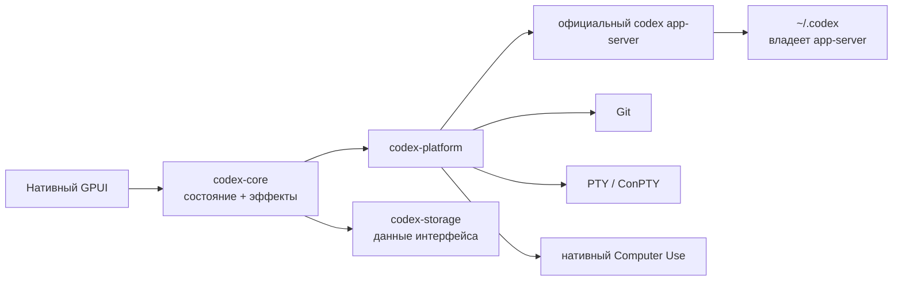

<p align="center">
  
</p>

<h1 align="center">codexRS</h1>

<p align="center">
  Нативный рабочий клиент на Rust для официального Codex app-server.<br>
  Задачи, диффы, ветки, worktree, терминал, Computer Use и плагины без браузерного runtime.
</p>

<p align="center">
  <a href="README.md">English</a> ·
  <a href="README.ru.md">Русский</a> ·
  <a href="README.zh-CN.md">简体中文</a>
</p>

<p align="center">
  <a href="https://github.com/Kiwunaka/codexRS/actions/workflows/ci.yml"></a>
  <a href="https://github.com/Kiwunaka/codexRS/releases"></a>
  <a href="LICENSE"></a>
  <a href="https://github.com/Kiwunaka/codexRS/stargazers"></a>
  <a href="https://github.com/Kiwunaka/codexRS/graphs/contributors"></a>
  
</p>

> [!IMPORTANT]
> Текущее дерево готовится как `v0.1.0-rc.1`. На Windows уже пройден сквозной
> smoke-тест исходной сборки с точным stable-эталоном. Linux проверяется в
> нативном CI, но до стабильного релиза нужны тесты на большем числе окружений.

## Зачем нужен codexRS

Codex Desktop удобен, но многим нужен более компактный и прозрачный нативный
клиент. Такой, где понятно, какой процесс запущен, кто владеет данными и где
стоят пределы по памяти и очередям. codexRS устроен именно так:

- нативный интерфейс на Rust и GPUI;
- без Electron, Tauri, Wry, WebView, Node.js и встроенного браузера;
- источником истины остаётся официальный `codex app-server`;
- по умолчанию клиент работает прямо с `~/.codex`;
- сам codexRS не открывает живые auth, SQLite, JSONL и логи Codex.

Эталон поведения: Codex Desktop `26.721.3996.0` со встроенной Codex CLI
[`0.146.0-alpha.3.1`](https://github.com/openai/codex/releases/tag/rust-v0.146.0-alpha.3.1).
Этот бинарник нужен для сверки совместимости. В репозиторий и сборки он не
входит.

## Что уже работает

| Область | Текущее состояние |
| --- | --- |
| Задачи | Ограниченные страницы, resume, fork, composer, потоковая лента и approvals |
| Репозиторий | Статус, staged/unstaged, большие виртуализированные диффы, переключение веток и безопасные соседние worktree |
| Терминал | Нативная PTY/ConPTY-сессия с ограниченным VT-выводом |
| Computer Use | Поиск окон, снимок, мышь, прокрутка, ввод текста и клавиши с двойным разрешением |
| Плагины | Просмотр marketplace, установка и удаление через методы app-server |
| Хранилище | Отдельный single-writer SQLite только для настроек codexRS и недавних рабочих папок |
| Платформы | Windows проверен локально; сборка и тесты Ubuntu запускаются в CI |

Computer Use включается отдельно для каждой задачи. Управление вводом требует
ещё одного явного разрешения на текущую сессию и выбора конкретного окна.
Снимки не сохраняются на диск и уменьшаются до заданного лимита до отправки в
протокол.

## Архитектура



У фреймов протокола, очередей, страниц истории, диффов, вывода терминала,
скриншотов и диагностики процессов есть жёсткие границы. Подробности:
[архитектура](docs/architecture.md) и
[поддержка платформ](docs/platform-support.md).

## Быстрый старт

### 1. Установите официальную Codex CLI

Следуйте актуальной [инструкции Codex CLI](https://learn.chatgpt.com/docs/codex/cli),
затем один раз запустите `codex` и войдите в аккаунт. codexRS запускает нативный
`app-server` из официальной CLI. Самому приложению Node.js не нужен.

Проверьте, что команда доступна:

```text
codex --version
```

Если CLI нет в `PATH`, задайте `CODEX_RS_CODEX_BIN` с путём к нативному
`codex` или `codex.exe`.

### 2. Соберите codexRS

Установите Git, Rust через `rustup` и нативные пакеты из раздела
[поддержки платформ](docs/platform-support.md), затем:

```text
git clone https://github.com/Kiwunaka/codexRS.git
cd codexRS
cargo build --release -p codex-app
```

Запуск на Windows:

```powershell
.\target\release\codexrs.exe
```

Запуск на Linux:

```bash
./target/release/codexrs
```

Пакеты для сборки под Linux и ограничения desktop-сессий перечислены в
[документе о платформах](docs/platform-support.md).

### Изолированная разработка

При обычном запуске используется `~/.codex`. Для разработки протокола и тестов
направьте `CODEX_HOME` в отдельную папку:

```powershell
$env:CODEX_HOME = 'E:\scratch\isolated-codex-home'
cargo run -p codex-app
```

Собственные данные codexRS можно отдельно перенести через
`CODEX_RS_DATA_DIR`.

## Как помочь проекту

Контрибьюты открыты. Сначала прочитайте
[CONTRIBUTING.md](CONTRIBUTING.md) и [AGENTS.md](AGENTS.md). Изменение должно
решать понятную задачу или подтверждённую ошибку. Большие функции лучше сначала
обсудить в issue или Discussions, чтобы до кода согласовать контракт.

- [План развития](ROADMAP.md)
- [Поддержка](SUPPORT.md)
- [Безопасность](SECURITY.md)
- [Кодекс поведения](CODE_OF_CONDUCT.md)
- [Разбор похожих проектов](docs/prior-art.md)

## Контрибьюторы

<a href="https://github.com/Kiwunaka/codexRS/graphs/contributors">
  
</a>

## Рост проекта

[](https://star-history.com/#Kiwunaka/codexRS&Date)

## Лицензия и связь с upstream

codexRS распространяется по [Apache License 2.0](LICENSE).

Это независимый проект сообщества, не связанный с OpenAI и не одобренный ею.
Названия Codex и OpenAI принадлежат их владельцам. Официальная Codex CLI
устанавливается и лицензируется отдельно.
