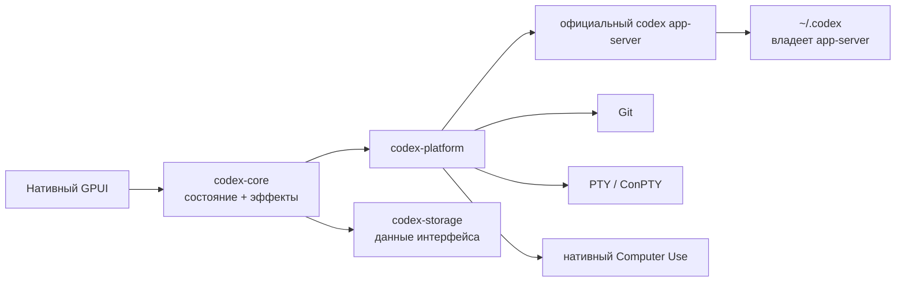

<p align="center">
  
</p>

<h1 align="center">codexRS</h1>

<p align="center">
  Нативная замена Codex Desktop на Rust с целью полного функционального и UX-паритета.<br>
  Совместимость с официальным app-server без Electron, WebView и браузерного runtime.
</p>

<p align="center">
  <a href="README.md">English</a> ·
  <a href="README.ru.md">Русский</a> ·
  <a href="README.zh-CN.md">简体中文</a>
</p>

<p align="center">
  <a href="https://github.com/Kiwunaka/codexRS/actions/workflows/ci.yml"></a>
  <a href="https://github.com/Kiwunaka/codexRS/releases"></a>
  <a href="LICENSE"></a>
  <a href="https://github.com/Kiwunaka/codexRS/stargazers"></a>
  <a href="https://github.com/Kiwunaka/codexRS/graphs/contributors"></a>
  
</p>

> [!IMPORTANT]
> Текущее дерево готовится как `v0.1.0-rc.4`. На Windows уже пройден сквозной
> smoke-тест исходной сборки с точным stable-эталоном. Linux проверяется в
> нативном CI, но до стабильного релиза нужны тесты на большем числе окружений.

## Зачем нужен codexRS

Codex Desktop удобен, но многим нужен более компактный и прозрачный нативный
клиент. Такой, где понятно, какой процесс запущен, кто владеет данными и где
стоят пределы по памяти и очередям. codexRS устроен именно так:

- нативный интерфейс на Rust и GPUI;
- без Electron, Tauri, Wry, WebView, Node.js и встроенного браузера;
- источником истины остаётся официальный `codex app-server`;
- по умолчанию клиент работает прямо с `~/.codex`;
- сам codexRS не открывает живые auth, SQLite, JSONL и логи Codex.

Эталон поведения: Codex Desktop `26.721.3996.0` со встроенной Codex CLI
[`0.146.0-alpha.3.1`](https://github.com/openai/codex/releases/tag/rust-v0.146.0-alpha.3.1).
Этот бинарник нужен для сверки совместимости. В репозиторий и сборки он не
входит.

## Что уже работает

| Область | Текущее состояние |
| --- | --- |
| Задачи | Ограниченные страницы, resume, fork, composer, потоковая лента и approvals |
| Репозиторий | Статус, staged/unstaged, большие виртуализированные диффы, переключение веток и безопасные соседние worktree |
| Терминал | Нативная PTY/ConPTY-сессия с ограниченным VT-выводом |
| Computer Use | Windows: поиск окон и управление с разрешением для конкретного приложения, доступом на задачу и allowlist под управлением app-server; Linux: ограниченное read-only наблюдение со скриншотами окон X11/XWayland при непустом `DISPLAY` |
| Плагины | Нативные вкладки каталога, ограниченная загрузка изображений, управление установленными и источниками, создание, add/remove/upgrade marketplace, установка и удаление через app-server |
| Хранилище | Отдельный single-writer SQLite для настроек codexRS и ограниченного реестра локальных проектов с именами и закреплением |
| Платформы | Windows проверен исходной сборкой; в Ubuntu CI собираются и тестируются UI, app-server, Git и PTY; Linux Computer Use даёт наблюдение со скриншотами X11/XWayland при непустом `DISPLAY` |

Computer Use включается отдельно для каждой задачи. Windows предоставляет
описанный ниже полный срез discovery и управления. В Linux доступно только
ограниченное read-only наблюдение со скриншотами окон X11/XWayland при
непустом `DISPLAY`; извлечение текста, ввод, запуск приложений, постоянные
разрешения, overlay и мониторинг прерываний недоступны, а pure Wayland без
XWayland не поддерживается. В Windows каждое чтение или действие
передаёт точный `Window { app, id, title? }` из ограниченного discovery;
codexRS заново находит непрозрачный ID и проверяет текущего владельца окна.
Выбор окна в нативном инспекторе — только ручное удобство. Перед первым
действием с каждым приложением codexRS запрашивает доступ к его реальному
идентификатору. На Windows packaged-приложения сохраняют AUMID с исходным
регистром. Executable получает stable-форму с GUID известной папки, когда это
возможно, иначе — абсолютный путь с исходным регистром; старые `process:` ID
по-прежнему распознаются при сопоставлении. Общие host-процессы и слишком
длинные ID блокируются. `Allow once` действует в текущей задаче, а
`Always allow` сохраняется через официальный app-server, но ни одно разрешение
не обходит product-policy запрет для Codex, терминалов, менеджеров паролей,
identity- и security-поверхностей. Нативный каталог Windows ограниченно читает обе папки
Start Menu, execution aliases и manifests установленных пакетов, показывает
приложения и запускает их; прямой запуск моделью проходит ту же per-app
проверку. Снимки не сохраняются на диск и уменьшаются до заданного
лимита до отправки в протокол. У каждого снимка есть короткоживущий ID, поэтому
координаты с уменьшенного изображения переводятся обратно в координаты
настоящего окна. На Windows дерево доступности и действия по индексам выполняет
отдельный нативный Rust-helper под надзором: максимум 512 элементов и 128 КиБ,
таймаут запроса 10 секунд, зависший сторонний UI Automation provider
останавливается вместе с helper и не замораживает клиент. Методы ввода сами
выводят точное целевое окно на передний план, а `activate_window` остаётся
явным recovery-действием как в stable Window2.
Перед защищённым вводом обязан появиться нативный индикатор поверх окон с
точным текстом stable: `ChatGPT is using your computer` / `Esc to cancel`.
Он живёт до конца Computer Use-хода, не забирает фокус и клики, не попадает в
скриншоты; если индикатор не показался, действие блокируется. На Windows этим
окном владеет поставляемый рядом `codex-computer-use-overlay.exe`: обмен с ним
ограничен, а Job Object гарантированно завершает helper вместе с клиентом.

## Архитектура



У фреймов протокола, очередей, страниц истории, диффов, вывода терминала,
скриншотов и диагностики процессов есть жёсткие границы. Подробности:
[архитектура](docs/architecture.md), [матрица паритета](docs/parity-matrix.md) и
[поддержка платформ](docs/platform-support.md).

## Быстрый старт

### 1. Установите официальную Codex CLI

Следуйте актуальной [инструкции Codex CLI](https://learn.chatgpt.com/docs/codex/cli),
затем один раз запустите `codex` и войдите в аккаунт. codexRS запускает нативный
`app-server` из официальной CLI. Самому приложению Node.js не нужен.

Проверьте, что команда доступна:

```text
codex --version
```

Если CLI нет в `PATH`, задайте `CODEX_RS_CODEX_BIN` с путём к нативному
`codex` или `codex.exe`.

### 2. Скачайте portable preview

Скачивайте только со страницы [GitHub Releases](https://github.com/Kiwunaka/codexRS/releases).
Артефакты RC4: `codexrs-v0.1.0-rc.4-windows-x86_64.zip` и
`codexrs-v0.1.0-rc.4-linux-x86_64.tar.gz`; рядом публикуется
`SHA256SUMS.txt`. Проверьте checksum до распаковки: в Linux выполните
`grep ' \./codexrs-v0.1.0-rc.4-linux-x86_64.tar.gz$' SHA256SUMS.txt | sha256sum -c -`,
а в Windows сравните
`(Get-FileHash .\codexrs-v0.1.0-rc.4-windows-x86_64.zip -Algorithm SHA256).Hash`
с соответствующей строкой. Checksum помогает заметить повреждение после
загрузки с доверенной страницы релиза, но не является независимой подписью
издателя.

Это неподписанные portable-архивы технического preview. Они не устанавливают
ярлык в Start Menu, URI handler, деинсталлятор или updater. Распакуйте их в
каталог под вашим контролем. В Windows `codexrs.exe` и
`codex-computer-use-overlay.exe` должны оставаться рядом. Для обновления
закройте codexRS и замените распакованный каталог; для удаления удалите только
этот каталог. Обе операции не удаляют `CODEX_HOME` и данные codexRS. Не
включайте Computer Use из архива, источнику или checksum которого не доверяете.

Linux-архив не является системным пакетом: он не ставит runtime-зависимости и
desktop integration. Ubuntu CI собирает и тестирует бинарник, но распакованный
архив ещё не проходил desktop smoke-тест. Linux Computer Use даёт только
ограниченное read-only наблюдение со скриншотами окон X11/XWayland при
непустом `DISPLAY`. Извлечение текста, ввод, запуск приложений, постоянные
разрешения, overlay и мониторинг прерываний недоступны; pure Wayland без
XWayland не поддерживается.

### 3. Соберите codexRS

Установите Git, Rust через `rustup` и нативные пакеты из раздела
[поддержки платформ](docs/platform-support.md), затем:

```text
git clone https://github.com/Kiwunaka/codexRS.git
cd codexRS
cargo build --release -p codex-app
```

Запуск на Windows:

```powershell
.\target\release\codexrs.exe
```

Запуск на Linux:

```bash
./target/release/codexrs
```

Пакеты для сборки под Linux и ограничения desktop-сессий перечислены в
[документе о платформах](docs/platform-support.md).

### Изолированная разработка

При обычном запуске используется `~/.codex`. Для разработки протокола и тестов
направьте `CODEX_HOME` в отдельную папку:

```powershell
$env:CODEX_HOME = 'E:\scratch\isolated-codex-home'
cargo build -p codex-app --bins
cargo run -p codex-app --bin codexrs
```

Собственные данные codexRS можно отдельно перенести через
`CODEX_RS_DATA_DIR`.

## Как помочь проекту

Контрибьюты открыты. Сначала прочитайте
[CONTRIBUTING.md](CONTRIBUTING.md) и [AGENTS.md](AGENTS.md). Изменение должно
решать понятную задачу или подтверждённую ошибку. Большие функции лучше сначала
обсудить в issue или Discussions, чтобы до кода согласовать контракт.

- [План развития](ROADMAP.md)
- [Матрица паритета с Codex Desktop](docs/parity-matrix.md)
- [Поддержка](SUPPORT.md)
- [Безопасность](SECURITY.md)
- [Кодекс поведения](CODE_OF_CONDUCT.md)
- [Разбор похожих проектов](docs/prior-art.md)

## Контрибьюторы

<a href="https://github.com/Kiwunaka/codexRS/graphs/contributors">
  
</a>

## Рост проекта

[](https://star-history.com/#Kiwunaka/codexRS&Date)

## Лицензия и связь с upstream

codexRS распространяется по [Apache License 2.0](LICENSE).

Это независимый проект сообщества, не связанный с OpenAI и не одобренный ею.
Названия Codex и OpenAI принадлежат их владельцам. Официальная Codex CLI
устанавливается и лицензируется отдельно.
