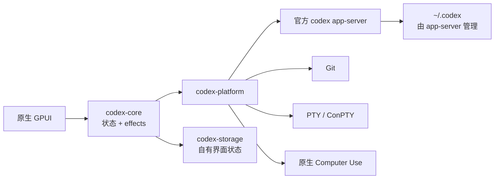

<p align="center">
  
</p>

<h1 align="center">codexRS</h1>

<p align="center">
  面向官方 Codex app-server 的原生 Rust 桌面客户端。<br>
  在无浏览器运行时的环境中管理任务、差异、分支、worktree、终端、Computer Use 与插件。
</p>

<p align="center">
  <a href="README.md">English</a> ·
  <a href="README.ru.md">Русский</a> ·
  <a href="README.zh-CN.md">简体中文</a>
</p>

<p align="center">
  <a href="https://github.com/Kiwunaka/codexRS/actions/workflows/ci.yml"></a>
  <a href="https://github.com/Kiwunaka/codexRS/releases"></a>
  <a href="LICENSE"></a>
  <a href="https://github.com/Kiwunaka/codexRS/stargazers"></a>
  <a href="https://github.com/Kiwunaka/codexRS/graphs/contributors"></a>
  
</p>

> [!IMPORTANT]
> 当前代码树以 `v0.1.0-rc.1` 为目标。Windows 已通过针对精确 stable
> 参考版本的源码端到端冒烟测试。Linux 已纳入原生 CI，但在稳定版发布前仍需覆盖更多桌面环境。

## 为什么选择 codexRS

codexRS 提供一个体积更小、边界更清晰的 Codex 原生客户端：

- 使用 Rust 与 GPUI 构建原生界面；
- 不包含 Electron、Tauri、Wry、WebView、Node.js 或嵌入式浏览器；
- 官方 `codex app-server` 始终是数据源；
- 默认直接使用 `~/.codex`；
- codexRS 本身不会直接打开实时 Codex auth、SQLite、JSONL 或日志文件。

行为参考版本为 Codex Desktop `26.721.3996.0`，其中包含 Codex CLI
[`0.146.0-alpha.3.1`](https://github.com/openai/codex/releases/tag/rust-v0.146.0-alpha.3.1)。
该上游二进制文件仅用于兼容性验证，不会随本项目分发。

## 已实现功能

| 领域 | 当前能力 |
| --- | --- |
| 任务 | 有界分页、恢复、fork、输入框、流式时间线与审批 |
| 仓库 | 状态、暂存/未暂存文件、大型虚拟化差异、分支切换与安全的同级 worktree |
| 终端 | 原生 PTY/ConPTY 与有界 VT 输出 |
| Computer Use | 原生窗口发现、截图、鼠标、滚动、文本与按键，并具有任务和会话双重授权 |
| 插件 | 通过 app-server 协议浏览、安装和卸载 marketplace 插件 |
| 持久化 | 独立单写者 SQLite，仅保存 codexRS 界面偏好与最近工作区 |
| 平台 | Windows 已完成源码冒烟测试；Ubuntu 在 CI 中构建并测试 |

Computer Use 必须按任务启用。输入操作还需要当前会话的明确授权以及已选择的窗口。截图只保留在内存中，并在进入协议前受到尺寸限制。

## 架构



协议帧、队列、历史分页、差异、终端输出、截图和进程诊断均具有明确上限。详见
[架构说明](docs/architecture.md)与[平台支持](docs/platform-support.md)。

## 快速开始

### 1. 安装官方 Codex CLI

按照最新的 [Codex CLI 指南](https://learn.chatgpt.com/docs/codex/cli)安装，
然后运行一次 `codex` 完成登录。codexRS 只负责监管 CLI 的原生
`app-server`，自身不依赖 Node.js。

```text
codex --version
```

如果 CLI 不在 `PATH` 中，请将 `CODEX_RS_CODEX_BIN` 设置为原生
`codex` 或 `codex.exe` 的路径。

### 2. 构建 codexRS

安装 Git、通过 `rustup` 安装 Rust，并准备[平台支持](docs/platform-support.md)
中列出的原生依赖：

```text
git clone https://github.com/Kiwunaka/codexRS.git
cd codexRS
cargo build --release -p codex-app
```

Windows：

```powershell
.\target\release\codexrs.exe
```

Linux：

```bash
./target/release/codexrs
```

Linux 构建依赖与桌面会话限制请参阅[平台支持](docs/platform-support.md)。

### 隔离开发环境

正常使用默认指向 `~/.codex`。协议开发和测试应将 `CODEX_HOME` 指向独立目录：

```powershell
$env:CODEX_HOME = 'E:\scratch\isolated-codex-home'
cargo run -p codex-app
```

可使用 `CODEX_RS_DATA_DIR` 单独重定向 codexRS 自有数据。

## 参与贡献

欢迎贡献。请先阅读 [CONTRIBUTING.md](CONTRIBUTING.md) 与
[AGENTS.md](AGENTS.md)。大型功能应先通过 issue 或 Discussions 明确行为契约。

- [路线图](ROADMAP.md)
- [支持](SUPPORT.md)
- [安全策略](SECURITY.md)
- [行为准则](CODE_OF_CONDUCT.md)
- [同类项目调研](docs/prior-art.md)

## 贡献者

<a href="https://github.com/Kiwunaka/codexRS/graphs/contributors">
  
</a>

## Star 趋势

[](https://star-history.com/#Kiwunaka/codexRS&Date)

## 许可证与上游声明

codexRS 使用 [Apache License 2.0](LICENSE)。

这是一个独立社区项目，与 OpenAI 无隶属或背书关系。Codex 与 OpenAI 名称归其各自所有者。官方 Codex CLI 需单独安装并遵循其许可。
