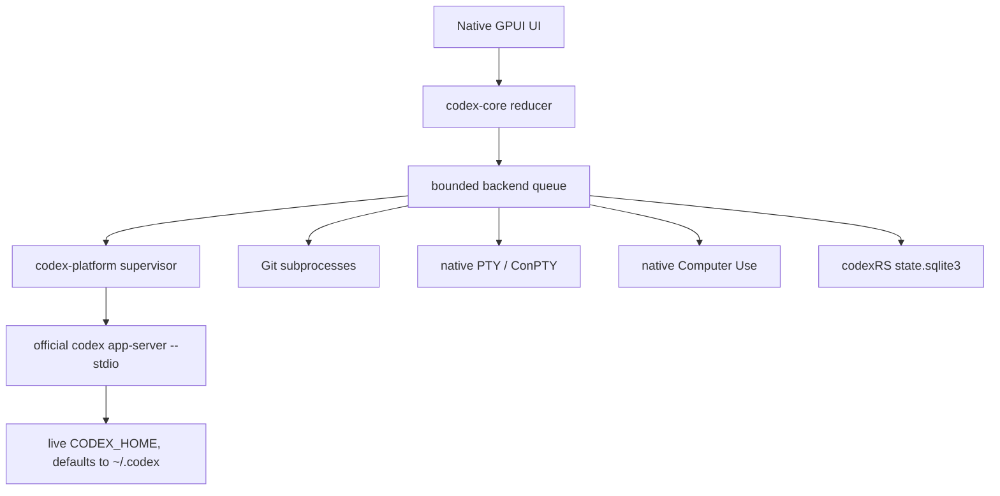

# Architecture

## Compatibility reference

codexRS uses Codex Desktop `26.721.3996.0` and its bundled Codex CLI
`0.146.0-alpha.3.1` as an executable behavioral specification. We reproduce
observable UI flows and the app-server contract. Extracted upstream code,
assets, and binaries are never runtime dependencies or release artifacts.

The runtime dependency is the user's separately installed official `codex`
executable.

## Workspace boundaries

```text
codex-app
├── codex-core       domain state, reducer, actions, and effects
├── codex-protocol   typed bounded app-server wire contract
├── codex-storage    codexRS-owned single-writer SQLite state
└── codex-platform   supervision, Git, PTY, paths, and Computer Use
```

The GPUI thread renders state and dispatches actions. Storage, Git, PTY,
Computer Use, and app-server calls execute behind a bounded backend queue.

## Runtime ownership



The official app-server is the only codexRS runtime component allowed to own or
interpret live Codex authentication, configuration, SQLite, JSONL, and logs.
codexRS does not mirror those writes and does not open those files directly.

Development and tests use an isolated `CODEX_HOME`. Snapshot imports may be
added for recovery or fixtures, but they must never become a second live
writer.

## App-server protocol

The supervisor maintains one long-lived, multiplexed stdio connection:

1. spawn `codex app-server --stdio`;
2. send `initialize` with `experimentalApi: true`;
3. receive the response and send `initialized`;
4. route bounded requests, notifications, approvals, and dynamic tool calls;
5. perform one graceful shutdown, followed by one bounded process-tree
   termination fallback.

Task discovery always uses paginated `thread/list` with
`useStateDbOnly: true`. Timeline items are loaded separately in bounded pages.
The default metadata page is 20 tasks and the maximum is 100.

Protocol limits include:

- 16 MiB per newline-delimited frame;
- 64 pending requests;
- 256 interleaved messages while waiting for a response;
- bounded command, event, and decoded-message channels;
- redacted diagnostics that never echo raw provider payloads.

## Git and worktrees

All Git commands run off the UI thread and are serialized by the backend.
Filesystem notifications are coalesced and restarted through a 300 ms debounce
window, preventing repeated `git.exe` storms.

Metadata, diffs, stderr, branch names, file counts, and worktree counts have
explicit limits. Mutations use argument separators and validated native paths:

- branch switching accepts only names that pass `git check-ref-format`;
- worktree paths must be absolute siblings outside the selected repository;
- existing branches are attached without force;
- unknown branches are created explicitly;
- codexRS never runs force cleanup or destructive Git recovery.

## Terminal

The terminal uses a native PTY (`ConPTY` on Windows) and a bounded VT100 parser.
Commands and events use bounded channels, input is capped, and terminal output
is retained in a fixed scrollback rather than an unbounded transcript.

On Windows the child process tree is assigned to a Job Object. Shutdown is
graceful first and bounded afterward; there are no polling `taskkill` loops.

## Computer Use

Computer Use is exposed to app-server as a dynamic tool namespace when a new
task is created with the feature enabled. Older tasks must be recreated because
dynamic tools are fixed at `thread/start`.

The trust boundary has two gates:

1. Computer Use must be enabled for the task.
2. Pointer and keyboard input require explicit session authorization and a
   selected window.

Coordinates are relative to the selected window. Captures remain in memory,
accept at most 16,777,216 source pixels, scale to at most 1600×1200, encode as
bounded JPEG, and are rejected above 3 MiB. Text input is capped at 16 KiB.

The dynamic tool router and native implementation never log screenshots,
typed text, or unredacted tool payloads.

## codexRS-owned storage

`state.sqlite3` stores only UI preferences and recent workspace paths. The
connection is owned by the backend thread and rejects cross-thread access.

- schema changes use `PRAGMA user_version`;
- WAL and a bounded busy timeout are enabled;
- paths are lossless native byte sequences;
- queries are paginated and capped at 500 rows;
- preference keys are capped at 128 bytes and values at 64 KiB.

Default locations:

- Windows: `%LOCALAPPDATA%\codexRS\state.sqlite3`;
- Linux: `$XDG_DATA_HOME/codexRS/state.sqlite3`, falling back to
  `~/.local/share/codexRS/state.sqlite3`.

`CODEX_RS_DATA_DIR` overrides this location without changing `CODEX_HOME`.

## Release contract

Every contribution that changes runtime behavior must pass:

```text
python scripts/check_dependency_policy.py
cargo fmt --all --check
cargo clippy --workspace --all-targets -- -D warnings
cargo test --workspace
cargo build --release -p codex-app
```

CI runs the same native workspace on Windows and Ubuntu. The dependency policy
fails if Electron, Tauri, Wry, WebView, Node.js, or browser-runtime packages
enter the resolved Cargo graph.
